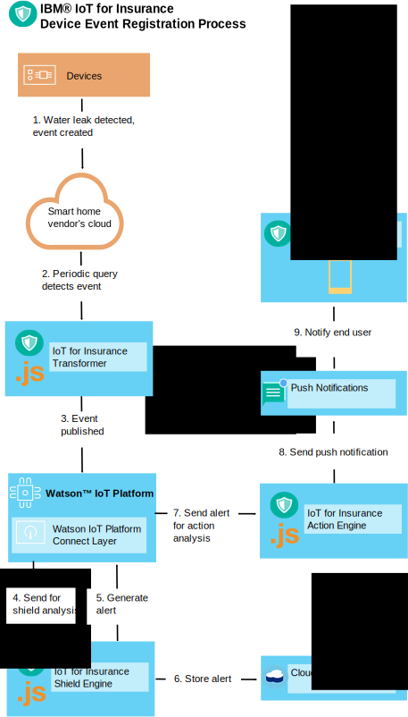

---

copyright:
  years: 2016, 2017
lastupdated: "2017-03-08"
---

<!-- Common attributes used in the template are defined as follows: -->
{:new_window: target="blank"}
{:shortdesc: .shortdesc}
{:screen: .screen}
{:codeblock: .codeblock}
{:pre: .pre}


# Using the device toolkit
{: #iot4i_connecting_devices}
By using the {{site.data.keyword.iotinsurance_full}} Device Toolkit, you can connect devices that are made by any device vendor to your {{site.data.keyword.iotinsurance_short}} service.
{:shortdesc}

Devices can send data directly to {{site.data.keyword.iot_full}} or through the device vendor's cloud. You connect devices by registering authorized users and then setting up device event generation and reception. For a list of supported devices and vendors and sample intergration procedures, see [Supported devices and vendors](iotinsurance_supporteddevices.html).

Use the instructions in the following sections to connect your devices.

## Registering authorized users
{: #reg_users}
When the device vendor's cloud supports OAuth as an authorization protocol, then {{site.data.keyword.iotinsurance_short}} can act as an OAuth client and connect to the vendor's cloud. A client ID and authorization that are obtained from the device vendor are required to receive and update data on behalf of the user.  

### OAuth flow
{: #oauth_flow}
The following diagram shows a simplified OAuth flow in which {{site.data.keyword.iotinsurance_short}} is authorized through an OAuth provider such as Facebook. In the diagram, {{site.data.keyword.iotinsurance_short}} requests access to an OAuth client, which redirects the access request to the OAuth provider. The provider produces an HTML form in which the {{site.data.keyword.iotinsurance_short}} user enters a user ID and password. The provider then grants authorization and optionally returns an OAuth code to enable updates. The diagram shows a very basic flow; OAuth providers typically offer multiple REST endpoints for the steps that are depicted in the diagram.  


### User registration flow
{: #user_reg_flow}

User registration varies by vendor. To understand how to get the required cloud access tokens and how to register them to {{site.data.keyword.iotinsurance_short}} by using the API, see [Supported devices and vendors](iotinsurance_supporteddevices.html).

#### Mobile registration flow (*deprecated*)

**Note**: The mobile app supports only Wink and changes to {{site.data.keyword.amashort}}
have disabled the user registration flow that is described in this section. This flow is available only for existing instances of version 1.0 of {{site.data.keyword.iotinsurance_short}}.

The following diagram shows a simplified user registration flow. In this example, a new user registration request is made from a mobile device. The request is processed by {{site.data.keyword.amafull}}, which provides an identifier to the customer's support system and sends the request to the API registration service. The API registration service redirects the OAuth request to the device vendor's cloud, which in turn verifies authentication with the customer's support system. The device vendor's cloud returns the authorization code or token to the API registration service. The registration service then creates the user and a unique API token in {{site.data.keyword.iot_short_notm}} and in {{site.data.keyword.cloudant}}.


## Generating device events
{: #generating_device_events}
Devices can connect to {{site.data.keyword.iot_short_notm}} when the manufacturer provides a direct authorization code that can be used with the API key that is generated during user registration. This type of connection is described in [Developing devices on {{site.data.keyword.iot_short_notm}}](https://console.{DomainName}/docs/services/IoT/devices/device_dev_index.html).

When the device is connected through the vendor's cloud, device events are sent through a connection that uses the REST endpoint provided by the device vendor. The OAuth bearer token that is obtained during user registration grants authorization for these calls. The {{site.data.keyword.iotinsurance_short}} transformer pulls the associated user information for each device from the vendor's cloud. It then includes the user association with the device event data that it passes to {{site.data.keyword.iot_short_notm}}.

When the device is connected directly to {{site.data.keyword.iot_short_notm}}, the link between the device and user is stored in {{site.data.keyword.iot_short_notm}}. The {{site.data.keyword.iotinsurance_short}} transformer caches that information and then enriches device events with the link to the user.

### Cloud to Cloud - device event flow
{: #device_event_flow}
The following diagram shows a simplified device event flow. In this example, a device detects a water leak. The {{site.data.keyword.iotinsurance_short}} transformer periodically polls the vendor's cloud for changes in device status. When the event is detected, the transformer sends it to {{site.data.keyword.iot_short_notm}}. The {{site.data.keyword.iotinsurance_short}} shield engine analyzes the event and then generates an alert and stores the alert in {{site.data.keyword.cloudant}}. {{site.data.keyword.iot_short_notm}} transfers the alert to the {{site.data.keyword.iotinsurance_short}} action engine for analysis. The action engine then pushes the alert to the consumer's mobile app through {{site.data.keyword.mobilepushshort}}.  



### How to set up polling for device status
{: #device_polling}
The transformer microservice is responsible for polling and receiving status updates. If the device vendor’s REST API supports asynchronous device updates, you can establish a subscription that enables the transformer to receive device status updates as they occur. Otherwise, you can set up the transformer to poll for device status updates.

The following pseudo-function calls are used to define the polling process:

*Table 1: Pseudo-function calls*

Pseudo-function | Description
------------- | -------------
`getRegisteredUserDevices(userName)` | Retrieves the available registered user devices that are using the user name.
`getProviderDevices(providerUserToken)` | Calls the device provider REST API to get the status of user devices that are using the user bearer token.
`findDevicesToAdd(), findDevicesToDel(), findDevicesToUpdate()` | Finds new devices, deleted devices, and modified devices by comparing registered devices with devices that currently exist in the device-provider.
` syncData()` | Sync the user devices by deleting old devices, adding new devices, and updating modified devices.  
 `notifyIoTP()` | Notify the {{site.data.keyword.iot_short_notm}} with changes such as MQTT events.

The transformer posts status updates to the {{site.data.keyword.iot_short_notm}}, as shown in the following code example.
```
// as specified in VCAP.services
var appClientConfig = {
  "org":iot_org,
  "id":iot_appid,
  "auth-key":iot_authkey,
  "auth-token":iot_authtoken
};

var appClient = new iotclient.IotfApplication(appClientConfig);
try {
  appClient.connect();
} catch (err) {
  console.log('IoT connect failed with error' +err);
}

...

// generate IoT event, note that the content is an arbitrary JSON object  
try {
  appClient.publishDeviceEvent("iOS",userToken.username, "status", "json", JSON.stringify(iotDevice));
} catch (err) {
  console.log('IoT publish failed with error' +err +'foruser' +userToken.username);
}

```

The transformer uses {{site.data.keyword.cloudant}} to access user data such as the bearer token and to store the last known device status for comparison purposes.  The following {{site.data.keyword.cloudant}} methods and code snippets are provided as a reference.  

`getUserTokensByProvider`  This method gets all user tokens of a particular provider.

```
dbHelper.getUserTokensByProvider(provider, function (err,results) {
  if (!err) {
    console.log(results.token.length + " tokens retrieved for provider: " + Provider);
  } else {
    console.log("no tokens returned, err:",err);
  }
  });
```

`getDevicesByUser` - This method retrieves all registered user devices by user name.
```
dbHelper.getDevicesByUser(username, function (err,results) {
  if (!err) {
    console.log(results.length + " devices retrieved for username: " + username);
  } else {
    console.log("no devices returned, err:",err);
  }
  });
```

`bulkUpdateDevices` - This method updates or adds a group of user devices.
```
dbHelper.bulkUpdateDevices(userDevices, function (err,results) {
  if (!err) {
    console.log(results.length + " devices updated");
    } else {
      console.log("no devices updated, err:",err);
    }
  });
```

`bulkDelDevices` - This method deletes a group of user devices.
```
dbhelper.bulkDelDevices(userDevices, function (err, results) {
  if (!err) {
    console.log(results.length + "devices deleted");
  } else {
    console.log("no devices deleted, err:",err);
  }
  });

```


## Deploying a new transformer instance
{: #deploy_new_transformer}
You can deploy a new transformer instance in the same organization and space in which your {{site.data.keyword.iotinsurance_short}} is deployed.  

**Note:** For information and assistance when deploying a new transformer instance, see [Contacting support](../support/index.html#contacting-support).

Before you begin, download and install the Cloud Foundry command line interface. Use the Cloud Foundry command line interface to modify and deploy service instances to {{site.data.keyword.iot_short_notm}}. For more information, see [Start coding with the cf command line interface ](https://www.ng.bluemix.net/docs/#starters/install_cli.html){:new_window}.

1. In the command line interface, change your directory to the `directory with sources and deployment descriptor YML file` by using the following command:
```
$ cd directory_name
```
2. List all apps in {{site.data.keyword.iotinsurance_short}} and make a note of the name of the transformer. The name ends in `transformer`.

3. Stop the {{site.data.keyword.iotinsurance_short}} transformer. For example,
```
$ cf stop iot4i-dev-transformer
```
4. List all services included in  {{site.data.keyword.iotinsurance_short}} and make a note of the names of the {{site.data.keyword.iot_short_notm}} and {{site.data.keyword.cloudant}} services.  The name of the {{site.data.keyword.iot_short_notm}} services includes the letters `iotf` in the name. The name of the {{site.data.keyword.cloudant}} service includes `cloudant` in the name.

5. Using the names that you noted in the previous steps, create a deployment descriptor file that is similar to the following example.  
  ```
  applications:
  - path: .
    memory: 1024M
    instances: 1
    name: iot4i-dev-transformer
    no-route: false
    disk_quota: 1024M
    command: node index.js
    services:
    - iot4i-iotf-service
    - iot4i-cloudantNoSQLDB
    env:
       ENV: dev
       APIDOMAIN: iot4insurance-api-v.mybluemix.net
       NODE_MODULES_CACHE: false
  ```
6. Push your transformer into {{site.data.keyword.Bluemix_notm}} by using the following command, replacing `newtransformer` with the name of your deployment descriptor file:
  ```
  $ cf push -f newtransformer.yml
  ```
7. You can check the logs to view deployment messages by using the following command:
  ```
  $ cf logs iot4i-dev-transformer
  ```
