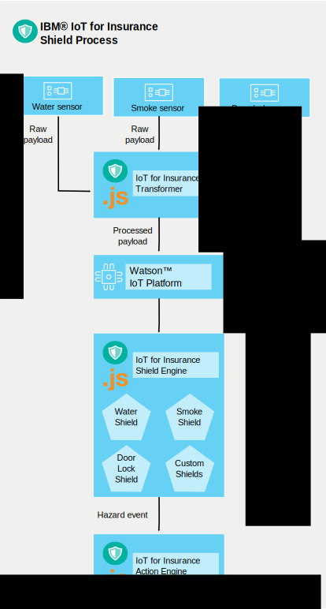

---

copyright:
  years: 2016, 2017
lastupdated: "2017-12-28"
---

<!-- Common attributes used in the template are defined as follows: -->
{:new_window: target="blank"}
{:shortdesc: .shortdesc}
{:screen: .screen}
{:codeblock: .codeblock}
{:pre: .pre}
{:note: .deprecated}

# How the service works (Deprecated)
{: #iot4i_how_service_works}

**This service is deprecated:** For more information, see the [deprecation announcement blog](https://www.ibm.com/blogs/bluemix/2017/11/iot-for-insurance-on-bluemix-migrated-to-saas-offering/){: new_window}.

However, {{site.data.keyword.iotinsurance_short}} is not going away. As of 31 July 2017, {{site.data.keyword.iotinsurance_short}} became a SaaS offering. The SaaS offering is available on [IBM Marketplace](https://www.ibm.com/us-en/marketplace/ibm-iot-for-insurance){: new_window}. Product documentation for the SaaS offering of {{site.data.keyword.iotinsurance_full}} is in the [IBM Knowledge Center](https://www.ibm.com/support/knowledgecenter/SSQNYQ/iot-insurance/kc_welcome.html){: new_window}.

Existing instances of this service can be used until 12 December 2018. However, you are encouraged to migrate to the SaaS offering of {{site.data.keyword.iotinsurance_short}}. If you have data from this service that you want to migrate to the SaaS offering, you must open a [ticket at https://console.bluemix.net/](https://console.bluemix.net/){: new_window} under **Support > Add Ticket**.  
{: deprecated}

---

{{site.data.keyword.iotinsurance_full}} creates a flow to collect, manage, and analyze data from connected policy holders.
{:shortdesc}

The insurance provider creates an instance of {{site.data.keyword.iotinsurance_short}} within the {{site.data.keyword.Bluemix_notm}} organization. Customers of the insurer have sensors in their homes which are connected to the sensor provider's cloud. From their mobile devices, customers authorize the {{site.data.keyword.iotinsurance_short}} service to receive sensor data. The {{site.data.keyword.iotinsurance_short}} Transformer connects to the sensor provider's cloud and pulls data for each user and sends it to the {{site.data.keyword.iot_short_notm}} server. If the sensor shows that the parameters that are specified in the insurer's shields are met in the customer's home, notifications are sent to the insurer's dashboard and to the customer's device.

A connected sensor detects an event, such as a water leak, and sends that information to a smart home vendor, such as Wink.  {{site.data.keyword.iotinsurance_short}} detects the signal by using its connection with the smart home vendor's cloud and creates an alert payload. The payload is sent through MQTT to the {{site.data.keyword.iotinsurance_short}} shield engine for processing. The shield engine analyzes whether the payload matches criteria that are defined by the shield rules. If it does, the shield engine emits a hazard payload through MQTT to the {{site.data.keyword.iotinsurance_short}} action engine. The action engine performs actions that are defined by the shield for that type of hazard, for example, sending a text message to the homeowner.

{{site.data.keyword.iotinsurance_short}} relies on {{site.data.keyword.iot_full}} to pass alert and hazard payloads between its components. A complete working system requires users, shields, and associations between users and shields.

