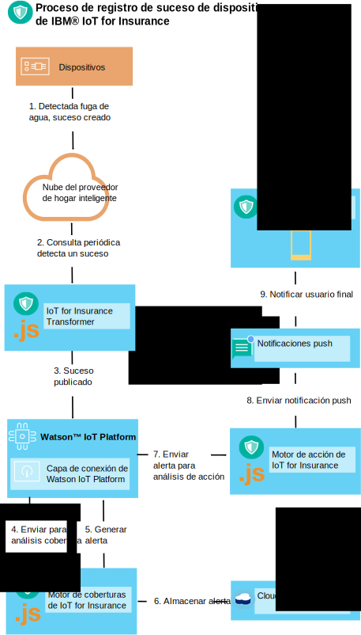

---

copyright:
  years: 2016, 2017
lastupdated: "2017-03-08"
---

<!-- Common attributes used in the template are defined as follows: -->
{:new_window: target="blank"}
{:shortdesc: .shortdesc}
{:screen: .screen}
{:codeblock: .codeblock}
{:pre: .pre}


# Utilización del kit de herramientas del dispositivo
{: #iot4i_connecting_devices}
Al utilizar el kit de herramientas del dispositivo {{site.data.keyword.iotinsurance_full}}, puede conectar dispositivos fabricados por cualquier proveedor de dispositivos a su servicio {{site.data.keyword.iotinsurance_short}}.
{:shortdesc}

Los dispositivos pueden enviar datos directamente a {{site.data.keyword.iot_full}} o a través de la nube del proveedor del dispositivo. Conecte dispositivos registrando a los usuarios autorizados y configurando la generación y recepción de sucesos de dispositivo. Para obtener una lista de dispositivos y proveedores soportados y procedimientos de integración de ejemplo, consulte [Proveedores y dispositivos soportados](iotinsurance_supporteddevices.html).

Utilice las instrucciones en las secciones siguientes para conectar sus dispositivos.

## Registro de usuarios autorizados
{: #reg_users}
Si la nube del proveedor del dispositivo admite OAuth como protocolo de autorización, {{site.data.keyword.iotinsurance_short}} puede actuar como cliente de OAuth y conectarse a la nube del proveedor. Se requiere un ID de cliente y autorización, que proporciona el proveedor de dispositivos, para recibir y actualizar datos en nombre del usuario.  

### Flujo de OAuth
{: #oauth_flow}
El siguiente diagrama muestra un flujo de OAuth simplificado, en el que {{site.data.keyword.iotinsurance_short}} está autorizado a través de un proveedor de OAuth como Facebook. En el diagrama, {{site.data.keyword.iotinsurance_short}} solicita acceso a un cliente de OAuth, que redirige la solicitud de acceso al proveedor de OAuth. El proveedor genera un formulario HTML en el que el usuario de {{site.data.keyword.iotinsurance_short}} especifica un ID de usuario y una contraseña. A continuación, el proveedor otorga la autorización y, opcionalmente, devuelve un código OAuth para habilitar actualizaciones. El diagrama muestra un flujo muy básico; los proveedores de OAuth normalmente ofrecen varios puntos finales REST para los pasos que se ilustran en el diagrama.  


### Flujo de registro de usuario
{: #user_reg_flow}

El registro de usuario varía según el proveedor. Para comprender cómo obtener las señales de acceso a la nube necesarias para su registro en {{site.data.keyword.iotinsurance_short}} utilizando la API, consulte [Proveedores y dispositivos soportados](iotinsurance_supporteddevices.html).

#### Flujo de registro móvil (*en desuso*)

**Nota**: la aplicación móvil solo admite Wink y los cambios en {{site.data.keyword.amashort}}
han inhabilitado el flujo de registro de usuario que se describe en esta sección. Este flujo solo está disponible para instancias existentes de la versión 1.0 de {{site.data.keyword.iotinsurance_short}}.

El siguiente diagrama muestra un flujo de registro de usuario simplificado. En este ejemplo, se crea una nueva solicitud de registro de usuario a partir de un dispositivo móvil. {{site.data.keyword.amafull}} procesa la solicitud, que proporciona un identificador al sistema de soporte al cliente y envía la solicitud al servicio de registro de API. El servicio de registro de API redirige la solicitud de OAuth a la nube del proveedor del dispositivo, que a su vez verifica la autenticación con el sistema de soporte al cliente. La nube del proveedor del dispositivo devuelve un token o código de autorización al servicio de registro de API. A continuación, el servicio de registro crea el usuario y un token de API exclusivo en {{site.data.keyword.iot_short_notm}} y en {{site.data.keyword.cloudant}}.


## Generación de sucesos de dispositivo
{: #generating_device_events}
Los dispositivos pueden conectarse a {{site.data.keyword.iot_short_notm}} si el fabricante proporciona un código de autorización directo, que puede utilizarse con la clave de API que se genera durante el registro de usuario. Este tipo de conexión se describe en [Desarrollo de dispositivos en {{site.data.keyword.iot_short_notm}}](https://console.{DomainName}/docs/services/IoT/devices/device_dev_index.html).

Si el dispositivo se conecta a través de la nube del proveedor, los sucesos de dispositivo se envían mediante una conexión que utiliza el punto final REST que proporciona el proveedor del dispositivo. La señal de transporte de OAuth que se obtiene durante el registro de usuario otorga autorización para estas llamadas. El transformador de {{site.data.keyword.iotinsurance_short}} toma la información del usuario asociado para cada dispositivo de la nube del proveedor. A continuación, incluye la asociación de usuario con los datos de suceso de dispositivo que pasa a {{site.data.keyword.iot_short_notm}}.

Cuando el dispositivo se conecta directamente a {{site.data.keyword.iot_short_notm}}, el enlace entre el dispositivo y el usuario se almacena en {{site.data.keyword.iot_short_notm}}. El transformador de {{site.data.keyword.iotinsurance_short}} recoge esta información y enriquece los sucesos de dispositivo con el enlace al usuario.

### Cloud to Cloud - flujo de suceso de dispositivo
{: #device_event_flow}
El siguiente diagrama muestra un flujo de suceso de dispositivo simplificado. En este ejemplo, un dispositivo detecta una fuga de agua. El transformador de {{site.data.keyword.iotinsurance_short}} sondea periódicamente la nube del proveedor por si hay cambios en el estado del dispositivo. Cuando se detecta un suceso, el transformador lo envía a {{site.data.keyword.iot_short_notm}}. El motor de coberturas de {{site.data.keyword.iotinsurance_short}} analiza el suceso y, a continuación, genera una alerta y la almacena en {{site.data.keyword.cloudant}}. {{site.data.keyword.iot_short_notm}} transfiere la alerta al motor de acción de {{site.data.keyword.iotinsurance_short}} para su análisis. El motor de acción envía la alerta a la aplicación móvil del consumidor a través de {{site.data.keyword.mobilepushshort}}.  



### Cómo configurar sondeos de estado del dispositivo
{: #device_polling}
El microservicio del transformador es el encargado de sondear y recibir actualizaciones de estado. Si la API REST del proveedor del dispositivo admite las actualizaciones de dispositivos asíncronos, puede establecer una suscripción que permita que el transformador reciba actualizaciones de estado a medida que se producen. De lo contrario, puede configurar el transformador para sondear actualizaciones de estado de dispositivos.

Las siguientes llamadas de pseudo-función se utilizan para definir el proceso de sondeo:

*Tabla 1: Llamadas de pseudo-función*

Pseudo-función | Descripción
------------- | -------------
`getRegisteredUserDevices(userName)` | Recupera los dispositivos de usuario registrado disponibles, que están utilizando el nombre de usuario.
`getProviderDevices(providerUserToken)` | Llama a la API REST API del proveedor del dispositivo para obtener el estado de los dispositivos de usuario que están utilizando la señal de transporte del usuario.
`findDevicesToAdd(), findDevicesToDel(), findDevicesToUpdate()` | Encuentra nuevos dispositivos, dispositivos suprimidos y dispositivos modificados comparando dispositivos registrados que actualmente existen en el proveedor del dispositivo.` syncData()` | Sincroniza los dispositivos de usuario suprimiendo dispositivos antiguos, añadiendo nuevos dispositivos y actualizando dispositivos modificados.  
 `notifyIoTP()` | Notifique al {{site.data.keyword.iot_short_notm}} cambios como sucesos MQTT.

El transformador publica actualizaciones de estado al {{site.data.keyword.iot_short_notm}}, como se muestra en el siguiente ejemplo de código.
```
// as specified in VCAP.services
var appClientConfig = {
  "org":iot_org,
  "id":iot_appid,
  "auth-key":iot_authkey,
  "auth-token":iot_authtoken
};

var appClient = new iotclient.IotfApplication(appClientConfig);
try {
  appClient.connect();
} catch (err) {
  console.log('IoT connect failed with error' +err);
}

...

// generate IoT event, note that the content is an arbitrary JSON object  
try {
  appClient.publishDeviceEvent("iOS",userToken.username, "status", "json", JSON.stringify(iotDevice));
} catch (err) {
  console.log('IoT publish failed with error' +err +'foruser' +userToken.username);
}

```

El transformador utiliza {{site.data.keyword.cloudant}} para acceder a datos de usuario, como la señal de transporte, y para almacenar el último estado del dispositivo a efectos de comparación.  Se proporcionan los siguientes fragmentos de código y métodos {{site.data.keyword.cloudant}} como referencia.  

`getUserTokensByProvider` Este método obtiene todas las señales de usuario de un proveedor particular.

```
dbHelper.getUserTokensByProvider(provider, function (err,results) {
  if (!err) {
    console.log(results.token.length + " tokens retrieved for provider: " + Provider);
  } else {
    console.log("no tokens returned, err:",err);
  }
  });
```

`getDevicesByUser` - Este método recupera todos los dispositivos de usuario registrados por nombre de usuario.
```
dbHelper.getDevicesByUser(username, function (err,results) {
  if (!err) {
    console.log(results.length + " devices retrieved for username: " + username);
  } else {
    console.log("no devices returned, err:",err);
  }
  });
```

`bulkUpdateDevices` - Este método actualiza o añade un grupo de dispositivos de usuario.
```
dbHelper.bulkUpdateDevices(userDevices, function (err,results) {
  if (!err) {
    console.log(results.length + " devices updated");
    } else {
      console.log("no devices updated, err:",err);
    }
  });
```

`bulkDelDevices` - Este método suprime un grupo de dispositivos de usuario.
```
dbhelper.bulkDelDevices(userDevices, function (err, results) {
  if (!err) {
    console.log(results.length + "devices deleted");
  } else {
    console.log("no devices deleted, err:",err);
  }
  });

```


## Despliegue de una nueva instancia de transformador
{: #deploy_new_transformer}
Puede desplegar una nueva instancia de transformador en la misma organización y espacio en la que se despliega {{site.data.keyword.iotinsurance_short}}.  

**Nota:** para obtener información y asistencia al desplegar una nueva instancia de transformador, consulte [Cómo obtener soporte](../support/index.html#contacting-support).

Antes de empezar, descargue e instale la interfaz de línea de mandatos Cloud Foundry. Utilice la interfaz de línea de mandatos Cloud Foundry para modificar y desplegar instancias de servicio en {{site.data.keyword.iot_short_notm}}. Para obtener más información, consulte [Cómo empezar a codificar con la interfaz de línea de mandatos cf ](https://www.ng.bluemix.net/docs/#starters/install_cli.html){:new_window}.

1. En la interfaz de línea de mandatos, cambie su directorio por `directorio con orígenes y archivo YML de descriptor de despliegue` utilizando el siguiente mandato:
```
$ cd directory_name
```
2. Liste todas las aplicaciones en {{site.data.keyword.iotinsurance_short}} y tome nota del nombre del transformador. El nombre finaliza en `transformer`.

3. Detenga el transformador {{site.data.keyword.iotinsurance_short}}. Por ejemplo,
```
$ cf stop iot4i-dev-transformer
```
4. Liste todos los servicios incluidos en {{site.data.keyword.iotinsurance_short}} y tome nota de los nombres de los servicios {{site.data.keyword.iot_short_notm}} y {{site.data.keyword.cloudant}}.  El nombre de los servicios {{site.data.keyword.iot_short_notm}} incluye las letras `iotf` en el nombre. El nombre del servicio {{site.data.keyword.cloudant}} incluye `cloudant` en el nombre.

5. Utilizando los nombres que ha anotado en los pasos anteriores, cree un archivo de descriptor de despliegue que sea similar al siguiente ejemplo.  
  ```
  applications:
  - path: .
    memory: 1024M
    instances: 1
    name: iot4i-dev-transformer
    no-route: false
    disk_quota: 1024M
    command: node index.js
    services:
    - iot4i-iotf-service
    - iot4i-cloudantNoSQLDB
    env:
       ENV: dev
       APIDOMAIN: iot4insurance-api-v.mybluemix.net
       NODE_MODULES_CACHE: false
  ```
6. Envíe el transformador a {{site.data.keyword.Bluemix_notm}} mediante el siguiente mandato, sustituyendo `newtransformer` por el nombre del archivo de descriptor de despliegue:
  ```
  $ cf push -f newtransformer.yml
  ```
7. Puede comprobar los registros para ver los mensajes de despliegue utilizando el siguiente mandato:
  ```
  $ cf logs iot4i-dev-transformer
  ```
